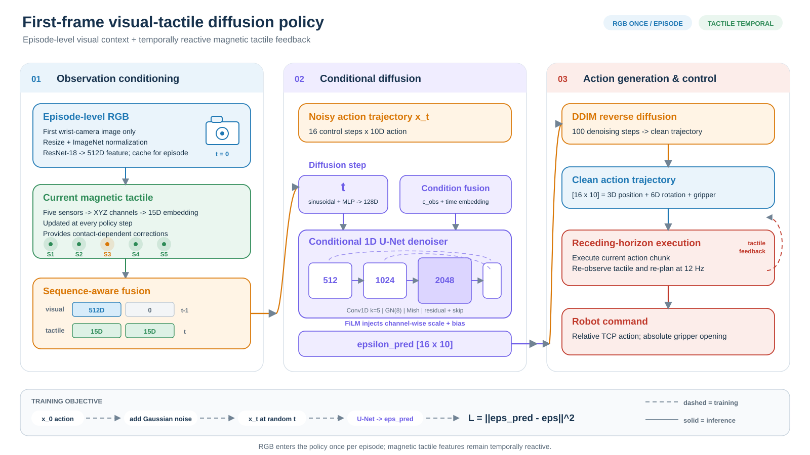

# PrintTac_UMI

**First-frame visual context and magnetic tactile diffusion policy learning from UMI demonstrations**

Convert UMI recordings into training-ready datasets, train diffusion policies, and deploy them on a real Franka robot.

  
  
  

  

> **Repository scope.** This repository contains the UMI data conversion, diffusion-policy training, Franka/Polymetis evaluation, and magnetic-tactile visualization pipeline used by PrintTac_UMI. It also retains the original Reactive Diffusion Policy components on which this project is built.

## Highlights

- **UMI-to-RDP conversion** from zipped Zarr trajectories to <code>replay_buffer.zarr</code>.
- **First-frame vision**: the absolute first RGB frame of each episode supplies scene context.
- **Temporal magnetic tactile feedback** throughout the policy horizon.
- **Standard visual-tactile baseline** and **first-frame policy** training entry points.
- **Real Franka deployment** through Polymetis with iPhone/OpenCV camera support.
- **Evaluation recording** for RGB video, magnetic traces, overlays, and vector visualization.

## End-to-End Pipeline

~~~mermaid
flowchart LR
    A[UMI recording] --> B[traj_command.zarr.zip]
    B --> C[convert_umi_traj_to_rdp_dataset.py]
    C --> D[replay_buffer.zarr]
    D --> E[train_dp.sh]
    D --> F[train_dp_first_frame.sh]
    E --> G[latest.ckpt]
    F --> G
    G --> H[eval.sh]
    H --> I[Franka execution]
    H --> J[Video and magnetic traces]
~~~

## Repository Layout

~~~text
PrintTac_UMI/
├── reactive_diffusion_policy/        # Models, datasets, workspaces, and robot runners
├── scripts/
│   ├── convert_umi_traj_to_rdp_dataset.py
│   ├── overlay_eval_video_with_magnet.py
│   ├── render_magnet_vector_video.py
│   └── extract_video_frames_without_magnet.py
├── docs/                             # Architecture notes and figures
├── train_dp.sh                       # Standard visual-tactile Diffusion Policy
├── train_dp_first_frame.sh           # First-frame visual-context policy
├── eval.sh                           # Main real-robot evaluation entry point
├── eval_test.sh                      # Experimental evaluation variant
└── eval_static_policy.sh             # Inference/recording with robot commands disabled

../data/                              # Recommended sibling directory for large data
├── dataset/                          # Raw and converted trajectories
├── calibration/v6/                   # Task transforms used by real-robot evaluation
├── outputs/                          # Training runs and checkpoints
└── eval_outputs/                     # Evaluation recordings and magnetic traces
~~~

The commands below assume that large data is stored in the repository's sibling directory <code>../data</code>. This keeps datasets, checkpoints, and videos out of Git.

## Installation

The current project is developed with Python 3.9. Install a CUDA-compatible PyTorch build for your machine, then install the repository requirements.

~~~bash
python3 -m venv rdp_venv
source rdp_venv/bin/activate

# Example versions used by the upstream RDP environment.
pip install torch==1.13.1+cu117 torchvision==0.14.1+cu117 torchaudio==0.13.1 \
  --extra-index-url https://download.pytorch.org/whl/cu117
pip install -r requirements.txt
~~~

For Franka deployment, complete the local Polymetis and robot setup described in [the Franka setup guide](docs/franka_setup_instructions.md). Camera, gripper, and serial-device dependencies depend on the hardware used in the experiment.

## 1. Convert UMI Data

The converter accepts a UMI/Franka Zarr directory or <code>.zarr.zip</code> archive and writes an RDP-compatible dataset containing <code>replay_buffer.zarr</code>.

### Recommended conversion

~~~bash
DATA_ROOT=../data

python scripts/convert_umi_traj_to_rdp_dataset.py \
  --input $DATA_ROOT/dataset/traj_command.zarr.zip \
  --output $DATA_ROOT/dataset/traj_rdp10d_command_downsample2 \
  --preset rdp10d \
  --temporal-downsample 2 \
  --image-size 240 320 \
  --magnet-key magnet_xyz \
  --magnet-mode tactile \
  --magnet-tactile-key left_gripper1_marker_offset_emb \
  --magnet-tactile-dim 15 \
  --action-source source \
  --overwrite \
  --validate
~~~

The output directory contains:

~~~text
../data/dataset/traj_rdp10d_command_downsample2/
└── replay_buffer.zarr/
~~~

> **Overwrite warning:** <code>--overwrite</code> replaces an existing target <code>replay_buffer.zarr</code>. Use a new output directory when preserving an earlier conversion.

### Key conversion options

| Option | Description |
|---|---|
| <code>--preset rdp10d</code> | Produces a TCP observation of shape <code>[9]</code> and an action of shape <code>[10] = xyz(3) + rotation6d(6) + gripper(1)</code>. |
| <code>--temporal-downsample 2</code> | Keeps every second timestep; approximately converts 25 Hz UMI data to 12.5 Hz. |
| <code>--image-size 240 320</code> | Matches the image shape used by the current training task. |
| <code>--action-source source</code> | Copies the recorded action/command stream. Recommended for command trajectories. |
| <code>--action-source next_obs</code> | Uses the next selected TCP observation while retaining the current recorded gripper command. |
| <code>--action-source auto</code> | Uses <code>next_obs</code> only when the source action is detected as an <code>obs[t+1]</code> proxy. |
| <code>--magnet-key magnet_xyz</code> | Selects the magnetic source array under the input dataset's <code>data/</code> group. |
| <code>--magnet-mode tactile</code> | Writes the 15D magnetic tactile key required by the example task. |
| <code>--validate</code> | Checks the converted dataset after writing. |

### Magnetic tactile requirement

The example task requires <code>left_gripper1_marker_offset_emb</code> with shape <code>[T, 15]</code>. If the source array is not named <code>magnet_xyz</code>, pass the correct name with <code>--magnet-key</code>. The converter can otherwise skip unavailable magnetic input, while the training task still expects the tactile key.

After conversion, verify the generated array explicitly:

~~~bash
python - <<'PY'
import zarr

root = zarr.open(
    '../data/dataset/traj_rdp10d_command_downsample2/replay_buffer.zarr',
    mode='r',
)
key = 'data/left_gripper1_marker_offset_emb'
print(key, root[key].shape, root[key].dtype)
assert root[key].ndim == 2 and root[key].shape[1] == 15
PY
~~~

### Choosing the action source

Use <code>source</code> when the UMI archive contains the command targets actually sent during demonstration. It preserves the demonstrated control intent and is the most reproducible option for a public training recipe.

<code>next_obs</code> reconstructs the TCP target from the next **selected** observation. With temporal downsampling, this target can be separated from the current sample by multiple raw frames. Observation noise, timestamp mismatch, state-estimation error, and control delay can therefore appear in the action labels and produce a visibly jittery policy. The converter intentionally keeps the current gripper command rather than shifting it with the TCP pose.

Use <code>auto</code> only when the input schema is understood and automatic <code>obs[t+1]</code> proxy detection is desired. For a paper release, explicitly record <code>source</code> or <code>next_obs</code> in the experiment command.

~~~bash
python scripts/convert_umi_traj_to_rdp_dataset.py --help
~~~

## 2. Train the Policy

### First-frame visual-context policy

This is the main entry point for the first-frame model.

~~~bash
TASK=real_wipe_image_gelsight_emb_dp_absolute_12fps \
DATASET_PATH=../data/dataset/traj_rdp10d_command_downsample2 \
NUM_EPOCHS=150 \
GPU_ID=0 \
bash train_dp_first_frame.sh
~~~

<code>train_dp_first_frame.sh</code> selects:

~~~text
CONFIG_NAME=train_diffusion_unet_first_frame_workspace
TASK=real_wipe_image_gelsight_emb_dp_absolute_12fps
~~~

The current first-frame workspace behaves as follows:

1. The episode's absolute first <code>left_wrist_img</code> frame is placed at visual timestep 0.
2. Later wrist-image slots are zeroed, so the policy does not receive new visual frames after the first frame.
3. Magnetic tactile features remain temporal and are available at each observation step.
4. The task's TCP pose and gripper-width keys remain in <code>shape_meta</code> as initial low-dimensional context; only keys selected by <code>temporal_low_dim_keys</code> are updated temporally.

The source of truth is [the first-frame workspace config](reactive_diffusion_policy/config/train_diffusion_unet_first_frame_workspace.yaml).

> **Scientific reproducibility note:** the current main task is not a strictly vision-and-tactile-only model because TCP pose and gripper width are present at the initial context step. The current shell entry points do not implement an active <code>EXCLUDE_TCP_OBS</code> switch. If the paper reports a strict no-TCP ablation, publish a dedicated task YAML that removes those keys from <code>shape_meta</code>, retrain it, and use the same YAML for evaluation.

### Standard visual-tactile baseline

~~~bash
TASK=real_wipe_image_gelsight_emb_dp_absolute_12fps \
DATASET_PATH=../data/dataset/traj_rdp10d_command_downsample2 \
NUM_EPOCHS=150 \
GPU_ID=0 \
bash train_dp.sh
~~~

### Common training controls

| Variable | Default | Purpose |
|---|---:|---|
| <code>GPU_ID</code> | <code>0</code> | CUDA device exposed to Accelerate. |
| <code>BATCH_SIZE</code> | <code>32</code> | Train and validation batch size. |
| <code>NUM_WORKERS</code> | <code>2</code> | DataLoader workers. |
| <code>NUM_EPOCHS</code> | config value | Overrides the configured number of epochs. |
| <code>LOGGING_MODE</code> | <code>disabled</code> | Logging backend mode. |
| <code>RELATIVE_ACTION</code> | unset | Overrides the dataset action representation only when explicitly set. |
| <code>RELATIVE_GRIPPER_ACTION</code> | unset | Overrides the gripper action representation. |

A typical run writes its checkpoint under:

~~~text
../data/outputs/YYYY.MM.DD/<run_name>/checkpoints/latest.ckpt
~~~

Keep the checkpoint together with its <code>.hydra/config.yaml</code>. The Hydra config records the input dimensions, observation keys, normalizers, and action representation required at evaluation time.

## 3. Evaluate on the Real Robot

> **Safety:** begin with a clear workspace, accessible emergency stop, short duration, and the static-policy test below. Never change the action representation only at evaluation time.

### Start the Franka services

Run each command in a separate terminal:

~~~bash
./scripts/franka_polymetis_launch_arm.sh
~~~

~~~bash
./scripts/franka_polymetis_launch_gripper.sh
~~~

~~~bash
./scripts/franka_polymetis_robot_server.sh
~~~

The evaluation script expects the robot command server at <code>http://127.0.0.1:8092</code> unless <code>ROBOT_SERVER_HOST</code> or <code>ROBOT_SERVER_PORT</code> is overridden.

### Prepare calibration

The evaluation entry point always supplies a calibration directory. Place the task-specific transforms under <code>../data/calibration/v6</code>, or override the path explicitly:

~~~bash
CALIBRATION_PATH=/absolute/path/to/calibration/v6
~~~

Do not reuse calibration files from a different camera, gripper, robot mounting, or workspace geometry.

### Static-policy smoke test

<code>eval_static_policy.sh</code> runs inference and recording while forcibly disabling startup motion, TCP commands, and gripper commands.

~~~bash
CONFIG_NAME=train_diffusion_unet_first_frame_workspace \
TASK=franka_polymetis_image_gelsight_emb_dp_absolute_12fps \
CKPT_PATH=../data/outputs/YYYY.MM.DD/RUN_NAME/checkpoints/latest.ckpt \
DATASET_PATH=../data/dataset/traj_rdp10d_command_downsample2 \
CALIBRATION_PATH=../data/calibration/v6 \
GRIPPER_SIGNAL_SOURCE=teleop_raw \
CAMERA_BACKEND=iphone \
CAMERA_SOURCE=auto \
ENABLE_MAGNET=True \
MAGNET_PORT=/dev/ttyACM0 \
MAX_DURATION=10 \
bash eval_static_policy.sh
~~~

### Learned-policy evaluation

~~~bash
DATA_DIR=../data \
CONFIG_NAME=train_diffusion_unet_first_frame_workspace \
TASK=franka_polymetis_image_gelsight_emb_dp_absolute_12fps \
CKPT_PATH=../data/outputs/YYYY.MM.DD/RUN_NAME/checkpoints/latest.ckpt \
DATASET_PATH=../data/dataset/traj_rdp10d_command_downsample2 \
CALIBRATION_PATH=../data/calibration/v6 \
GRIPPER_SIGNAL_SOURCE=teleop_raw \
CAMERA_BACKEND=iphone \
CAMERA_SOURCE=auto \
CAMERA_PREPROCESS_MODE=square_crop \
ENABLE_MAGNET=True \
MAGNET_PORT=/dev/ttyACM0 \
MAGNET_READER_SUBTRACT_BASELINE=True \
MAGNET_NORMALIZE_TO_FIRST_FRAME=False \
OPEN_GRIPPER_ON_START=False \
ASK_RESET_CONFIRMATION=True \
MOVE_TO_START=False \
MAX_DURATION=20 \
bash eval.sh
~~~

The public command uses <code>MOVE_TO_START=False</code> for the first learned rollout, so manually place the robot at a verified start pose. After validating the complete pipeline, automated startup motion can be enabled with <code>MOVE_TO_START=True</code> and a reviewed <code>MOVE_TO_START_POSE_PATH</code>; keep <code>ASK_RESET_CONFIRMATION=True</code>.

This recipe sets <code>GRIPPER_SIGNAL_SOURCE=teleop_raw</code> because <code>traj_command</code> demonstrations commonly store a 0-to-1 commanded open ratio. If the released dataset stores calibrated physical or marker width instead, use <code>umi_marker</code> or <code>teleop_width</code> consistently in dataset metadata and evaluation.

The command intentionally does not set <code>RELATIVE_ACTION</code>. The <code>*_absolute_*</code> task config uses absolute actions by default. Set <code>RELATIVE_ACTION=True</code> only for a checkpoint trained with the same relative-action definition and runner frame convention.

### Experiment-specific options

| Variable | Purpose |
|---|---|
| <code>GRIPPER_SIGNAL_SOURCE</code> | Selects <code>umi_marker</code>, <code>teleop_raw</code>, <code>teleop_width</code>, or <code>task_config</code>. It must match the dataset convention. |
| <code>START_GRIPPER_WIDTH_MM</code> | Commands an initial gripper width before rollout. |
| <code>MOVE_TO_START_POSE_PATH</code> | Loads an explicit start-pose JSON file. |
| <code>MAGNET_REZERO_AFTER_POLICY_START_SEC</code> | Applies a one-time magnetic baseline reset after policy start. |
| <code>MAGNET_SENSOR_ORDER</code> | Reorders physical sensors into the training channel order. |
| <code>TCP_ACTION_UPDATE_INTERVAL</code> | Controls how frequently queued TCP actions are refreshed. |
| <code>GRIPPER_ACTION_UPDATE_INTERVAL</code> | Controls how frequently queued gripper actions are refreshed. |
| <code>ENABLE_POLICY_RECORDING</code> | Saves camera and magnetic-overlay recordings. |

## Train/Eval Consistency

The following must match the checkpoint:

- <code>CONFIG_NAME</code> and task <code>shape_meta</code>.
- RGB and low-dimensional observation keys.
- Camera resize, crop, and color preprocessing.
- Magnetic channel count, sensor order, baseline subtraction, and normalization.
- Absolute versus relative TCP actions.
- Gripper signal source, stroke, units, and normalization.
- Observation horizon, temporal downsampling, control frequency, and latency.

A conditional-encoder error such as <code>1184</code> versus <code>1202</code> means that evaluation constructed a different observation vector from the checkpoint. This is commonly caused by adding or removing the 18 dimensions from two TCP-pose observations. Load the matching Hydra/task configuration; do not hide the mismatch with <code>strict=False</code>.

## Evaluation Outputs

~~~text
../data/eval_outputs/franka_polymetis/
├── debug_images/
└── policy_recordings/
    ├── episode_XXX_*_magnet_overlay.mp4
    ├── episode_XXX_*_magnet_trace.csv
    └── episode_XXX_*_magnet_trace.npz
~~~

The recorder saves the complete camera stream for debugging and paper figures. For the first-frame workspace, later recorded frames are **not** new visual inputs to the policy.

## Visualization

### Camera and magnetic-trace overlay

~~~bash
python scripts/overlay_eval_video_with_magnet.py \
  --trace-csv ../data/eval_outputs/franka_polymetis/policy_recordings/episode_000_magnet_trace.csv \
  --video ../data/eval_outputs/franka_polymetis/demos/example/tactile.mp4 \
  --output ../data/eval_outputs/franka_polymetis/demos/example/combined.mp4 \
  --frame-output-dir ../data/eval_outputs/franka_polymetis/demos/example/frames \
  --frame-save-interval 30 \
  --magnet-plot-output ../data/eval_outputs/franka_polymetis/demos/example/magnet_overview.png
~~~

The overlay script also supports trace/video trimming, video cropping, a magnetic offset file, manual x/y plot limits, and paper-style overview figures.

### Magnetic vector video

~~~bash
python scripts/render_magnet_vector_video.py \
  --input /path/to/magnetic.csv \
  --output /path/to/magnetic_vectors.mp4 \
  --vector-limit 30
~~~

### RGB-only frame export

Use <code>scripts/extract_video_frames_without_magnet.py</code> to export the camera region from a magnetic-overlay video at a fixed frame interval.

## Troubleshooting

### Connection refused on port 8092

The Polymetis HTTP bridge is not listening. Start <code>scripts/franka_polymetis_robot_server.sh</code>, then confirm that the arm and gripper services are alive.

### No observation received

Check that the configured camera is producing frames, the magnetic serial port is readable, all required observation keys are present, and sensor timestamps are advancing. A successful one-time magnetic rezero message is not itself an error.

### Policy motion is large or unstable

Check, in this order:

1. Absolute/relative action settings match training.
2. The evaluation task has the same observation keys as the checkpoint.
3. Dataset frequency matches the control and inference frequencies.
4. Camera and magnetic preprocessing match training.
5. Gripper units and signal source match the converted dataset.
6. The dataset was converted with the intended <code>--action-source</code>.

For command-recorded UMI data, first reconvert with <code>--action-source source</code> before adding controller smoothing.

## Reproducibility Checklist

- Save the exact conversion command and source archive checksum.
- Keep conversion validation output with the dataset.
- Preserve <code>.hydra/config.yaml</code> with every released checkpoint.
- Record action source, temporal downsampling, and effective policy frequency.
- Record camera preprocessing and magnetic sensor ordering.
- Archive the checkpoint, evaluation command, policy video, and magnetic trace together.

## Citation

The PrintTac_UMI citation will be added with the public paper release. Please also cite the upstream Reactive Diffusion Policy work used by this repository:

~~~bibtex
@inproceedings{xue2025reactive,
  title     = {Reactive Diffusion Policy: Slow-Fast Visual-Tactile Policy Learning for Contact-Rich Manipulation},
  author    = {Xue, Han and Ren, Jieji and Chen, Wendi and Zhang, Gu and Fang, Yuan and Gu, Guoying and Xu, Huazhe and Lu, Cewu},
  booktitle = {Proceedings of Robotics: Science and Systems (RSS)},
  year      = {2025}
}
~~~

## Acknowledgements

This project builds on [Reactive Diffusion Policy](https://github.com/Chen-Wendi/RDP), [Diffusion Policy](https://github.com/real-stanford/diffusion_policy), and [Universal Manipulation Interface](https://github.com/real-stanford/universal_manipulation_interface). We thank the authors for releasing their work.

## License

Original PrintTac_UMI modifications are provided under the applicable MIT terms. Bundled and upstream components retain their own licenses, including the additional third-party terms documented in [LICENSE](LICENSE).
